# Assignment 2.4 Screenshots
Proof of work screenshots.

## Docker Hub
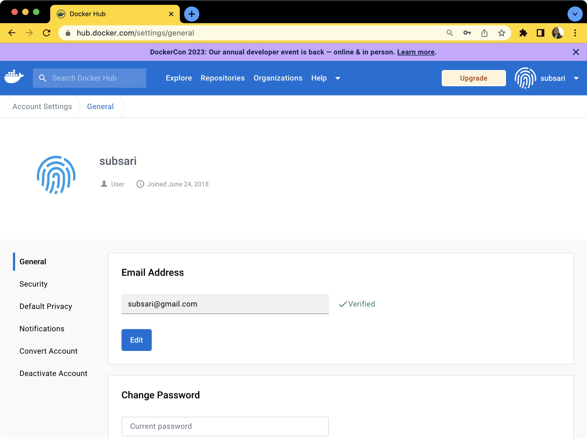

## Docker Playground
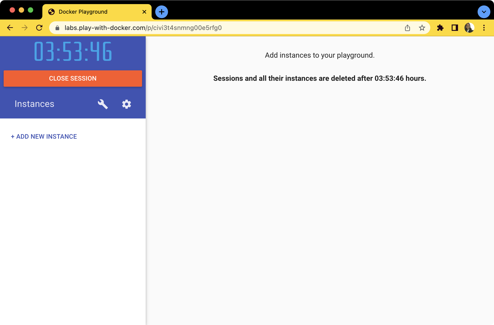

## Docker Ghost Instance
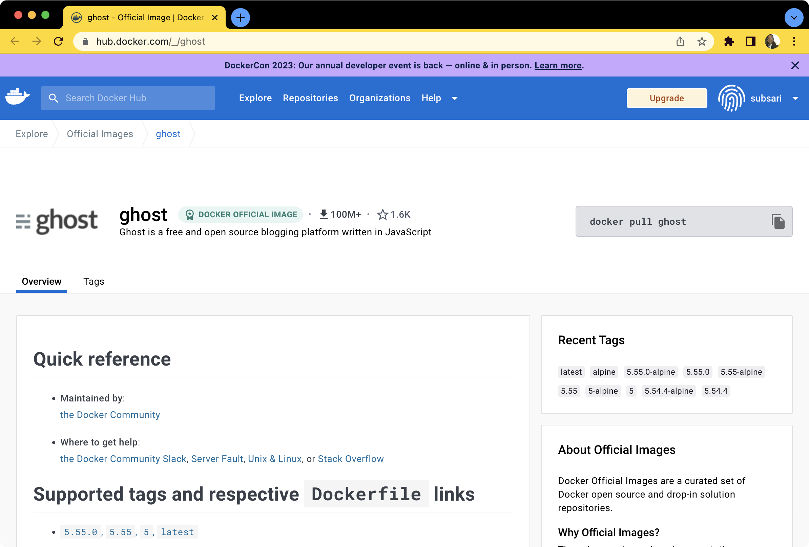

## Docker Ghost Running Locally Commands 
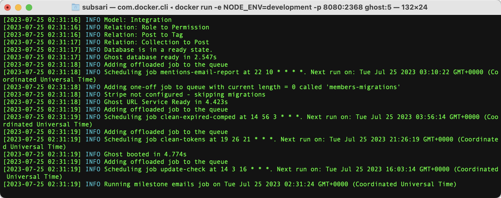

## Docker Ghost Setup Local Configuration 
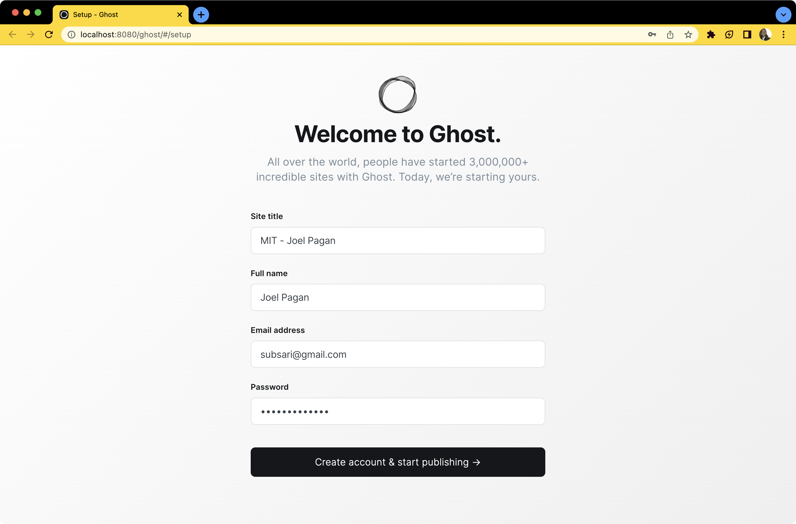

## Docker Ghost Setup Local Setup Completed
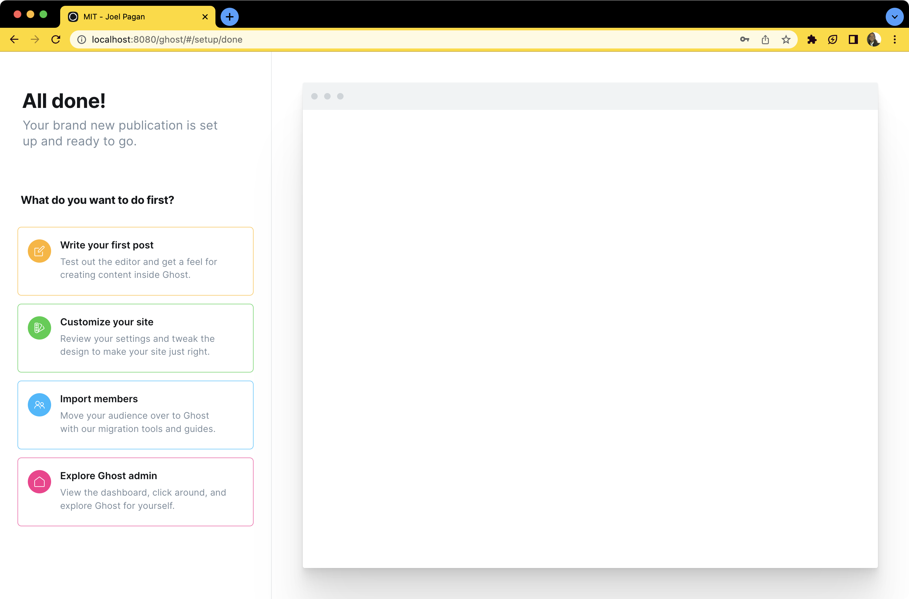

## Docker Ghost Setup Local Setup Completed
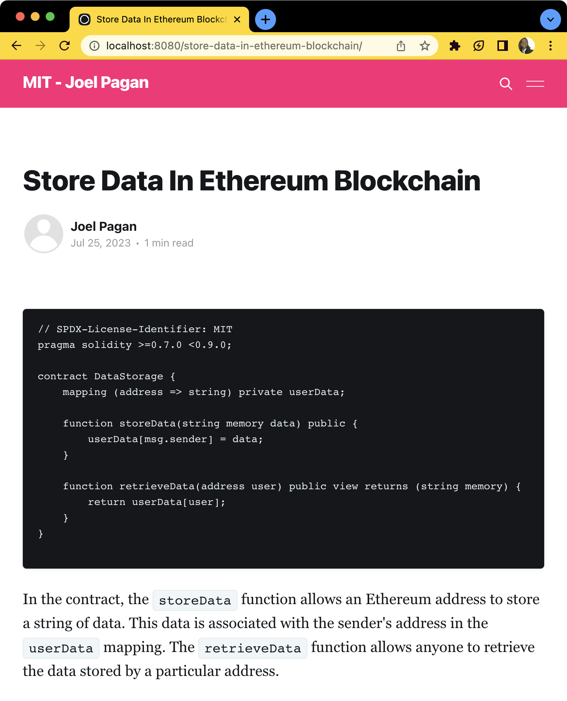

## Docker Ghost Stop Command
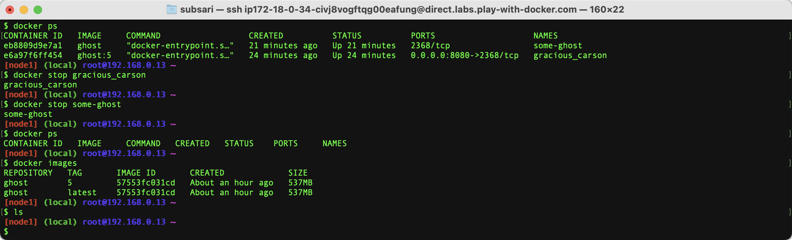

## Docker Build NodeJS
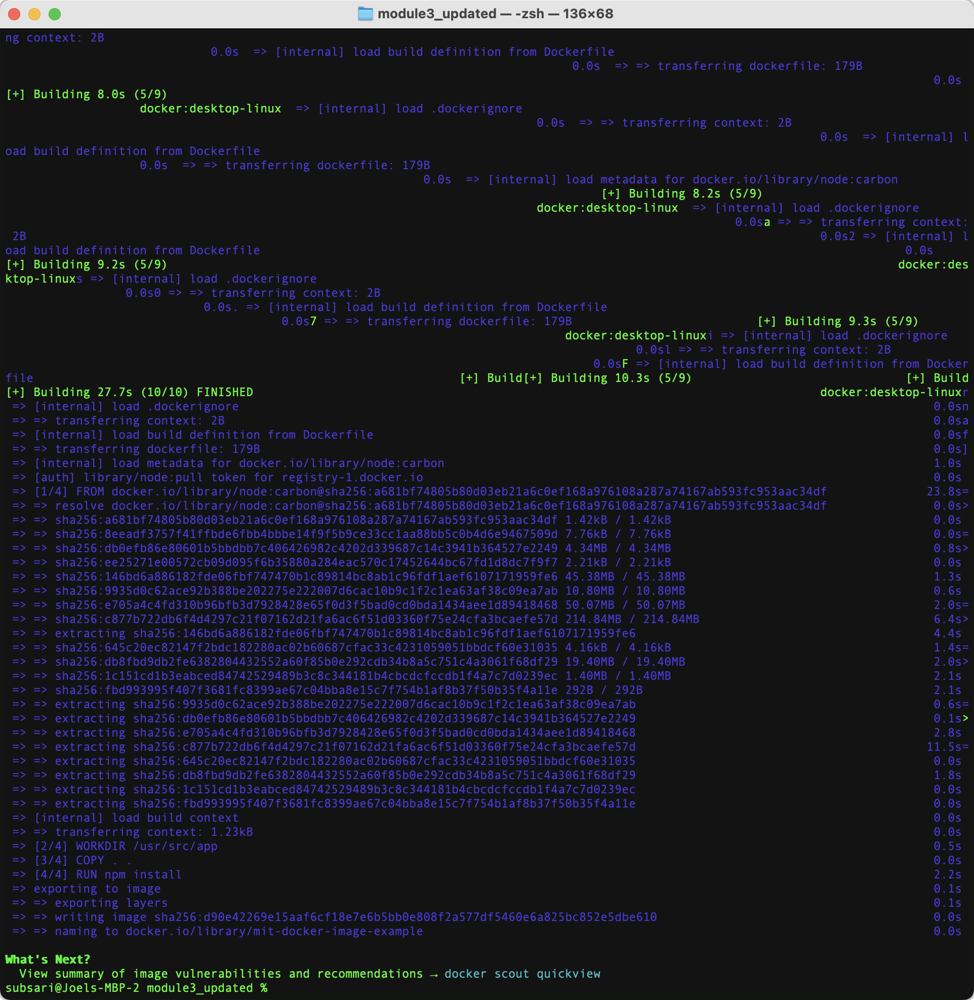
```
docker build -t mit-docker-image-example ./
```

```
docker run -p 3001:8080 mit-docker-image-example
```

## Docker Build Lucky Number From Scratch
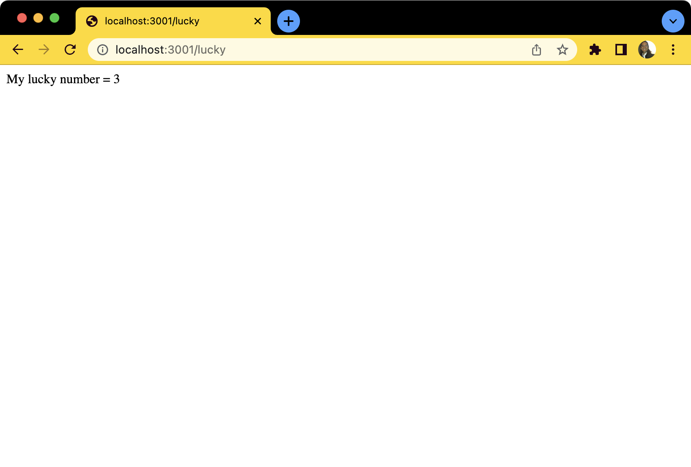

## Docker Repository
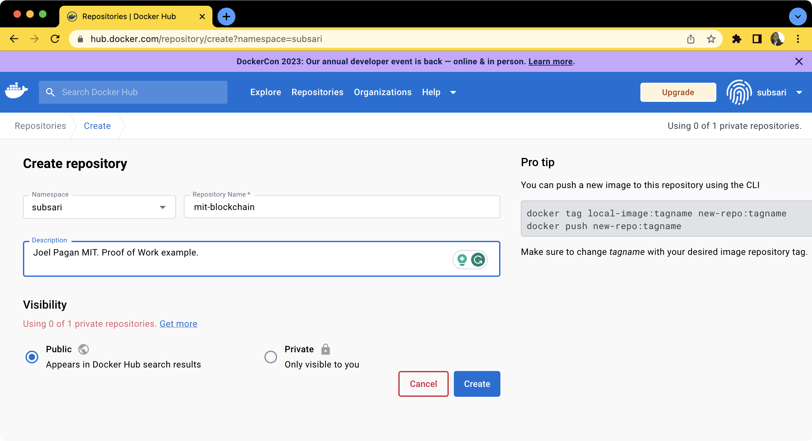

## Docker Images
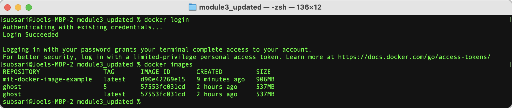

```
docker tag ImageID your_dockerhub_username/name_of_repo:firsttry
### Example using output of "docker images" command
docker tag d2f084719f3d mit/mit-repository:firsttry

```

```
docker push your_dockerhub_username/name_of_repo:firsttry
### Example using output of "docker images" command and tag created with "docker tag" command
docker push mit/mit-repository:firsttry
```

```
docker run -p 3001:8080 your_dockerhub_username/name_of_repo:firsttry
### Example
docker run -p 3001:8080 mit/mit-repository:firsttry
```

## Docker MIT Repository First Tag
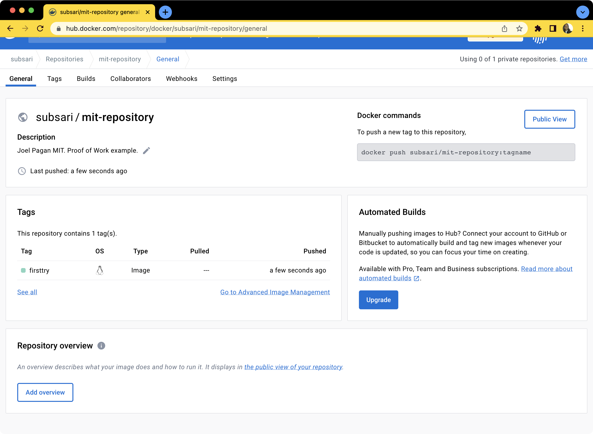

## Docker MIT Repository Running Image
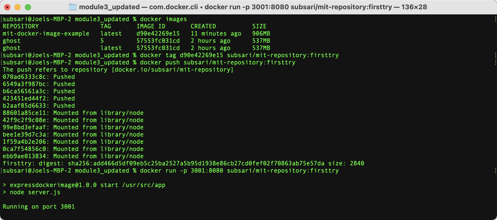

## Docker MIT Hello World From Scratch
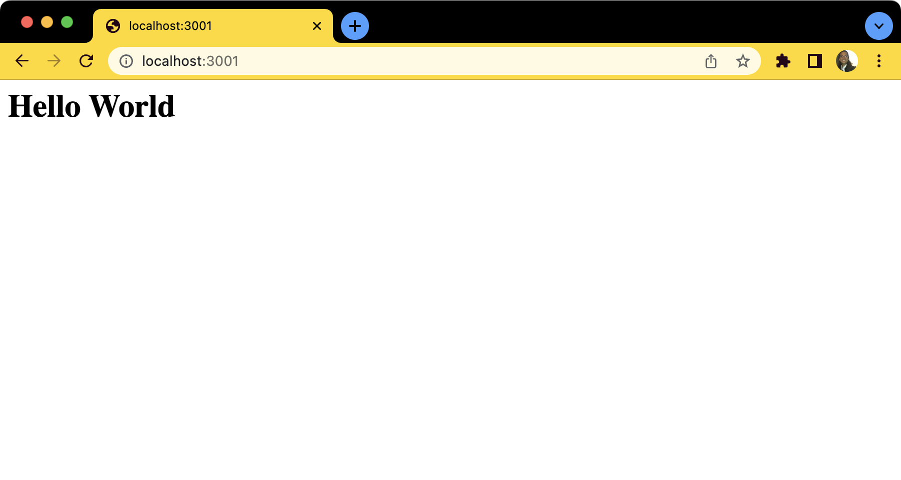


