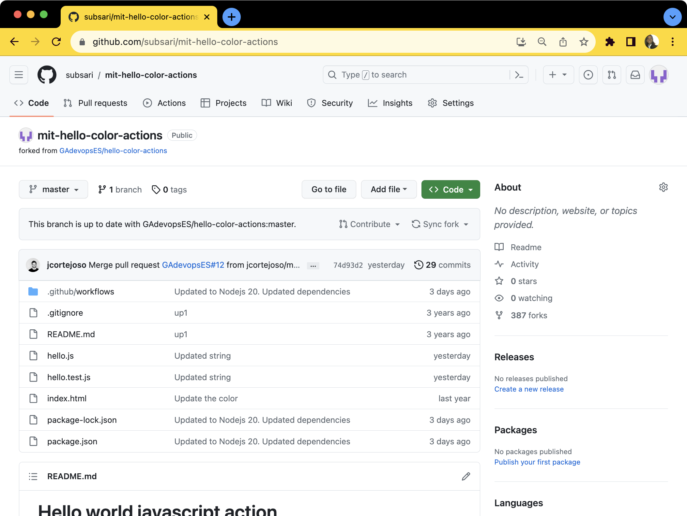
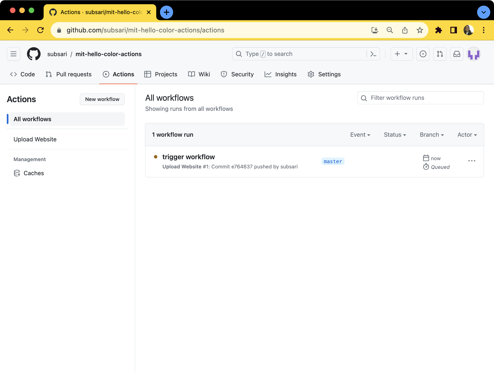
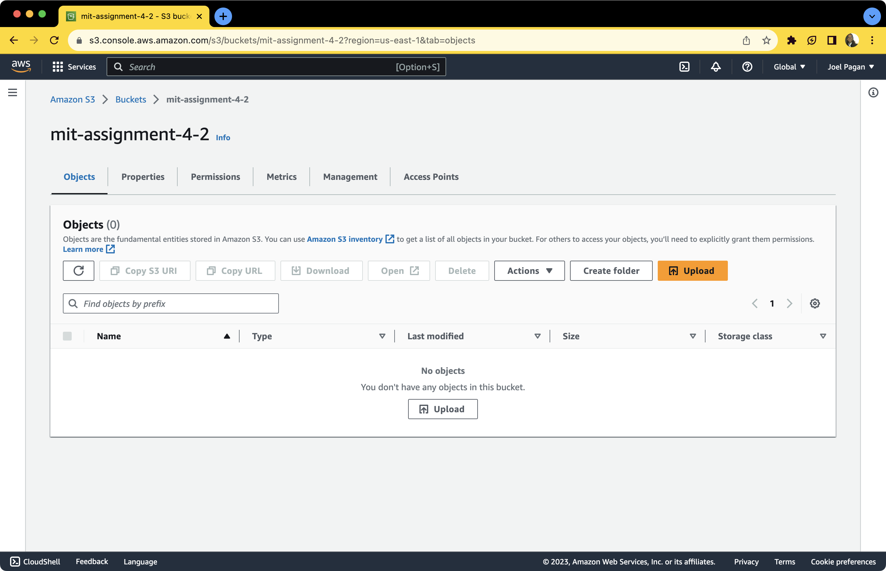
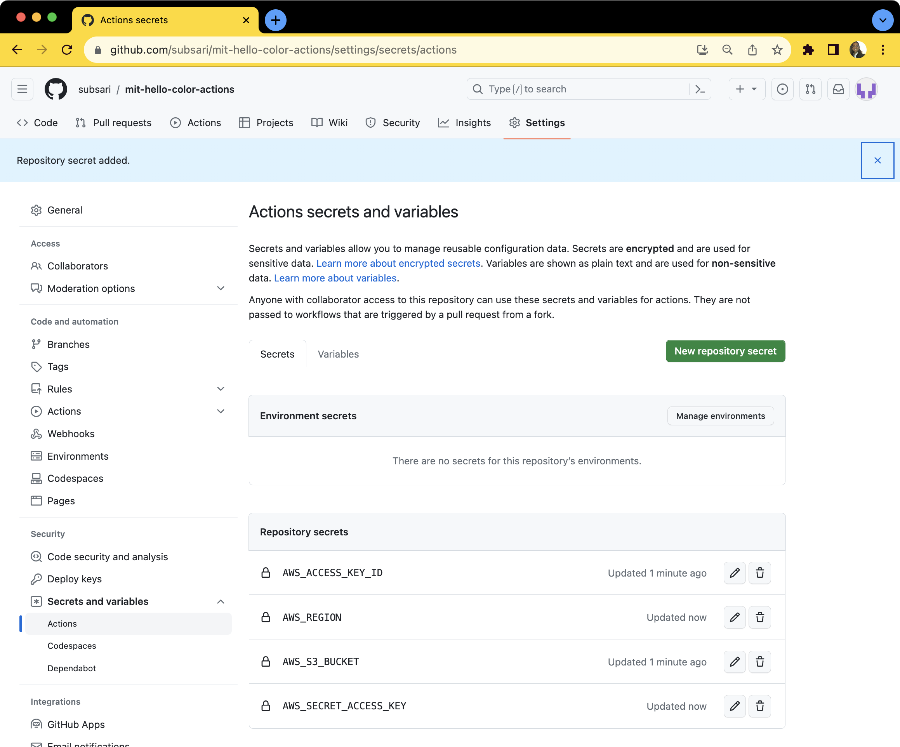
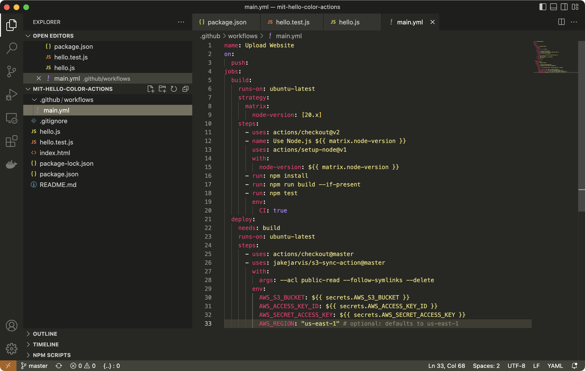
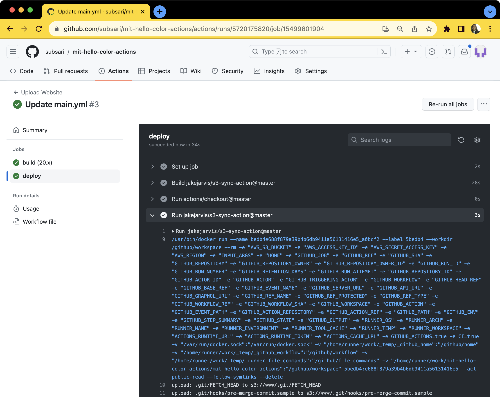
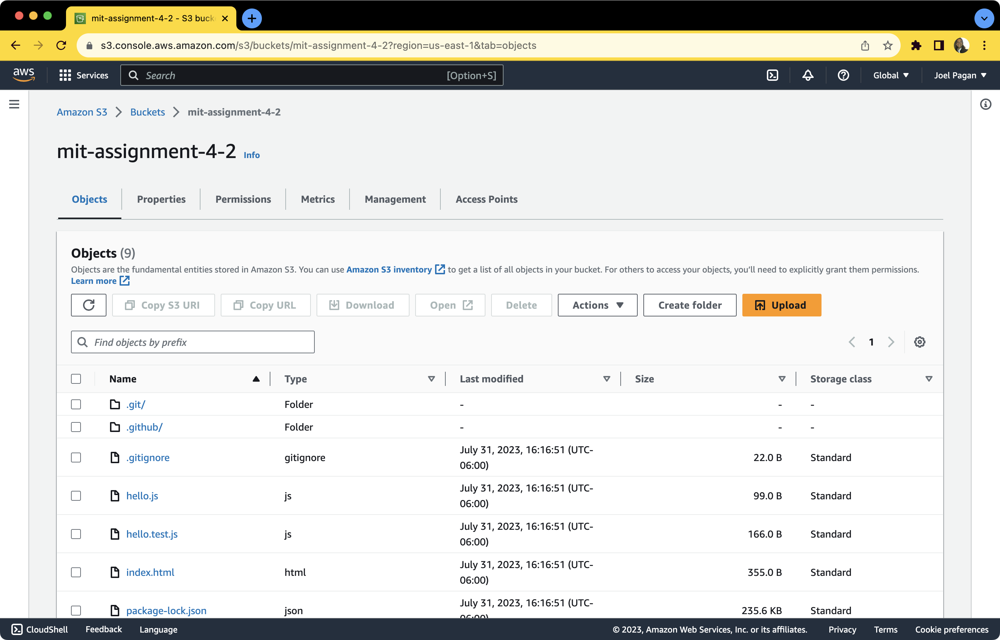

# Assignment 4.2 Screenshots
Proof of work screenshots.

## Colors Repo

## Workflow Configuration

## MIT Bucket

## Github Secrets

## YML File

## Github Actions Success Details

## Github Actions File Uploaded Success

